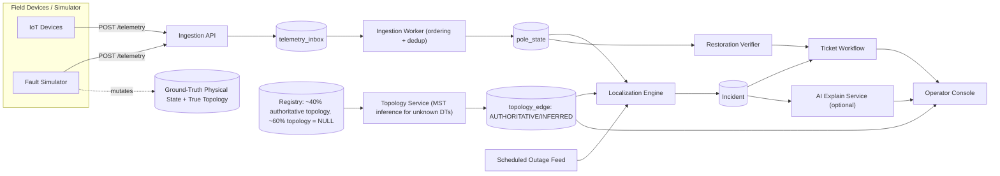

# KSPDB Fault Localization — Master Architecture & Implementation Plan

Prepared as the pre-coding planning artifact for the Propel AI Product Engineer take-home assignment.
**No application code should be written until this document is reviewed.**

---

## A. Problem Understanding

1. Telemetry events (`heartbeat`/`power_lost`/`power_restored`/`boot`) are noisy **symptoms** from individual devices, not ground truth about the electrical network.
2. **Physical electrical state** (which span is actually de-energized) is what really happened; it must be *inferred*, because devices only report pole-level lamp-point state — never current, voltage, or fault type.
3. **Topology** (which pole electrically feeds which) is the structural context needed to translate node-level LIVE/DARK observations into edge-level fault locations. It is authoritative for ~40% of DTs and entirely unrecorded for ~60%.
4. An **Incident** is the deterministically-derived root cause (one physical fault = one incident) — distinct from raw symptoms (many dark poles) and from a **Ticket** (the human-workflow wrapper with lifecycle state).
5. A Ticket carries operational state (ACK, crew, resolved, verified, closed) layered on an Incident; Incident correctness is independent of Ticket status.
6. Core deterministic principle: **LIVE upstream + DARK downstream ⇒ fault on the connecting edge.** A violation of the expected radial pattern (a DARK node with a LIVE descendant) is evidence of a *sensor* fault, not a line fault.
7. **Silence ≠ failure.** A heartbeat gap must be disambiguated among device-offline, stale/delayed delivery, dying-message loss (~30% of the time), and genuine power loss.
8. **Grouping is mandatory**: dozens of downstream symptom reports from one snapped wire must collapse into one incident; unrelated concurrent faults must not merge into one.
9. Scale is modest (steady ~39 msg/s, burst 5k/10s) — this does not need distributed stream infrastructure, but does need durable, per-device-ordered processing.
10. The missing-topology problem affects the *majority* of the network and needs an explicit, honestly-labeled inference strategy — not silent assumption of full knowledge.
11. Missing devices (~9%) create observability gaps that require **range** localization rather than an always-exact edge.
12. Confidence must be explainable and deterministic, tied to concrete evidence (topology source, boundary clarity, device coverage, staleness) — never an LLM-generated number.
13. Scheduled outages are **evidence**, not ground truth — the system reconciles "expected dark" against "actually observed dark" rather than blanket-suppressing telemetry.
14. Restoration must be machine-verified via telemetry; a human "resolved" claim is provisional until confirmed.
15. AI's proper role is explaining already-correct deterministic output in natural language — never deciding location, confidence, or grouping.

---

## B. Hardest Engineering Problems (ranked)

1. **Missing topology for ~60% of DTs.** Highest risk overall. Wrong handling either fabricates false precision or silently breaks localization for most of the network. *Strategy:* DT-rooted geometric MST inference — used explicitly and only as a **heuristic fallback for when real topology is unavailable**, not presented anywhere as ground truth or "the" correct answer. Every inferred edge is tagged `INFERRED`, ambiguous edges are flagged, and the system mechanically downgrades confidence whenever it's relying on this path (Section G/I) — the honesty of that downgrade matters more than the sophistication of the heuristic itself.
2. **Sensor fault vs. line fault vs. device silence.** Wrong classification generates false tickets (erodes operator trust) or misses real faults. *Strategy:* explicit pole state machine + radial-consistency check (dark ancestor with live descendant ⇒ sensor issue, no ticket).
3. **Symptom→incident grouping under noisy delivery.** The single most visible failure mode in a demo is "40 tickets instead of 1." *Strategy:* incremental per-DT-subtree frontier computation, idempotent re-evaluation.
4. **Debounce/ordering under duplicate, out-of-order, up-to-6h-delayed, ±90s-skewed telemetry.** Getting this wrong causes flapping tickets or stale rewrites. *Strategy:* per-device `seq` for intra-device ordering (never cross-device `ts`), server-receipt time for cross-device windows, supersede-by-seq for late events.
5. **Firmware 1.2.x silent devices (~8% of fleet).** If unmodeled: missed faults (silent pole never flagged dark) *and* false positives (healthy device timeout mistaken for outage). *Strategy:* heartbeat-timeout-based dark inference, gated specifically to known sub-1.3 firmware, corroborated by topology context.
6. **Scheduled-outage feed unreliability** (early/late/~10% cancelled-without-update). *Strategy:* treat as a confidence input, not a suppressor — ticket still created, tagged `scheduled_outage_overlap`, lower visual urgency, never hidden.
7. **DT-level vs. feeder-level vs. span-level classification.** Wrong granularity turns one clean incident into dozens, or hides a feeder-wide event as unrelated DT incidents. *Strategy:* hierarchical rollup with an explicit ≥90%-of-monitored-poles-dark threshold.
8. **Restoration verification without blind trust of humans.** *Strategy:* verification requires telemetry-confirmed LIVE across the full previously-affected pole set within a bounded window.
9. **Ingestion durability under burst (5,000 msgs/10s) without heavy infra.** *Strategy:* durable Postgres inbox table + `SKIP LOCKED` worker, decoupling fast-ack from processing.
10. **Explainable, non-fake confidence.** A wrong or arbitrary score undermines the whole "deterministic engine" narrative in the interview. *Strategy:* categorical HIGH/MEDIUM/LOW via a fixed rules table, evidence list always visible.
11. **Keeping simulator ground truth from leaking into localization.** If this boundary breaks, the entire demo is "cheating" on the central problem. *Strategy:* hard schema/module separation, plus a dedicated boundary test (Step 25).
12. **3-day time-box vs. documentation/test completeness (20% of the rubric combined).** *Strategy:* strict step ordering; tests written alongside the engine, not after; `DECISIONS.md` written incrementally, not retroactively.

---

## C. Explicit Assumptions

- Pole state → `CONFIRMED_DARK` only after (a) an explicit `power_lost`, held for ~90s (skew tolerance), or (b) two missed heartbeats beyond interval+skew (~32 min), with no other explanation.
- "Roughly simultaneous" for DT/feeder rollup = within a 5-minute correlation window.
- DT-level fault requires ≥90% of *monitored* poles under that DT observed dark within the window (accounts for the 9% no-device gap and partial delivery).
- Feeder-level fault requires the same ≥90% threshold applied across all DTs on the feeder.
- Firmware-1.2.x heartbeat-timeout inference applies only to poles whose last-known device `fw` is <1.3.
- Unknown-topology DTs are inferred via a haversine-distance MST rooted at the DT (GPS accuracy ~4m is good relative to typical pole spacing).
- Synthetic dataset target: ~3,000–5,000 poles across ~30–40 DTs on 4–6 feeders — enough to exercise every rule without simulating the full 38k-pole network.
- The AI explain feature uses a deployment-owned API key (env var), not a reviewer-provided one; on missing key/timeout/error it falls back to a deterministic template.
- No authentication is implemented (explicitly out of scope); the public console is open by URL.
- Missing PIN codes (~3%) inherit the PIN of the nearest sibling pole under the same DT — no external geocoding API, so public deployment never depends on a third-party key.
- A "range" localization = an explicit ordered list of bounding poles (last-confirmed-LIVE ancestor + first-confirmed-DARK descendants), never a fabricated lat/lon guess.
- Live UI updates use ~3s polling, not WebSockets, for reliability within the time-box; this comfortably meets the <2s list-load target.
- Every numeric constant referenced above (90s debounce, 32-min timeout, 90% rollup threshold, 15% ambiguity tolerance, 5-min correlation window, etc.) lives in exactly one place — a shared thresholds/config module (Step 16) — rather than as inline magic numbers, so each can be justified and tuned independently of the logic that uses it.

---

## D. Technology Stack

**Plain JavaScript everywhere** (no TypeScript — Satvik is more comfortable moving fast in JS/React, and the assignment's 3-day box rewards familiarity over ceremony), one repo, one `docker-compose.yml`.

| Layer | Choice | Why | Rejected |
|---|---|---|---|
| Backend | Node.js + Fastify (JavaScript) | Low overhead, explicit route handlers, easy for both Satvik and an AI agent to reason about; no build-step friction | TypeScript (extra tooling/compile step not worth it given the team's stronger JS fluency), NestJS (too much ceremony for 3 days) |
| DB/ORM | PostgreSQL + Prisma | ACID ticket transitions, recursive-CTE-friendly for small per-DT trees, agent-writable migrations; Prisma's generated client works fine from plain JS | MongoDB (relational graph model fits better), Neo4j (per-DT trees are tiny — overkill) |
| Queue | None — Postgres `telemetry_inbox` table + `SELECT ... FOR UPDATE SKIP LOCKED` worker | Durable, at-least-once, no extra service to deploy/debug at this scale (≤5k msgs/10s) | Kafka/RabbitMQ/Redis Streams (solve a scale problem we don't have) |
| Frontend | React (JavaScript, `.jsx`) + Vite + Tailwind | Fast to build a clean console without heavy design overhead, in the framework Satvik is most fluent in | TypeScript/React (dropped for the same reason as the backend) |
| Map | Leaflet or MapLibre GL + OpenStreetMap tiles | **No API key required** — critical for gate G4 | Google Maps JS API (needs a key) |
| Realtime | Short-interval polling (~3s) | Reliable to implement correctly in 3 days; meets the perf target | Socket.io/WS (stateful, riskier to deploy correctly; noted as P2) |
| Tests | Vitest | Fast, zero-config for a Vite/JS monorepo; localization engine is the highest-value test surface | — |
| AI feature | Anthropic API (server-side key) | One-shot explanation over deterministic JSON | Fine-tuned/local model (unnecessary complexity for a text-generation feature) |
| Deployment | Docker Compose (backend, frontend, Postgres) → Fly.io/Railway/Render | Single command locally; cheap multi-container public host | Kubernetes (direct rubric penalty for unnecessary complexity) |

Also rejected: microservice split by domain (adds network calls/deploy surface for no scale benefit), GraphQL (REST is simpler to test/document at this scope).

**On dropping TypeScript:** the trade-off is real — no compile-time checking on the domain contracts or Prisma payloads. This is compensated for, not ignored: Section F's domain model is still written down as a single source of truth (now as JSDoc `@typedef`s for editor autocomplete, not compiled types), and every trust boundary (`/telemetry` payload in, Incident JSON out, AI-service input) is validated at runtime with Zod rather than relied on at compile time. This is named explicitly in `DECISIONS.md` as a deliberate speed/safety trade-off, not an oversight.

---

## E. System Architecture

**Components:** Ingestion API → durable inbox → Ingestion Worker → Pole State → Topology Service (authoritative/inferred) → Localization Engine (+ Scheduled Outage Adapter as evidence input) → Incident → Ticket Service → Restoration Verifier; Simulator drives its own ground-truth store and emits telemetry through the *same* ingestion endpoint; AI Explain Service wraps a completed Incident with graceful fallback; Operator Console consumes Incidents/Tickets/Poles.

---

## F. Domain Model

- **Pole**: id, lat, lon, dt_id, feeder_id, seq_on_line?, parent_pole_id?, device_id?, ward, pincode?
- **Device**: id, current pole_id, fw_version, first_seen, last_seen (devices are swappable; seq numbering is per-device, not per-pole)
- **Transformer (DT)**: id, feeder_id, lat, lon, capacity_kva, households_served, topology_source
- **Feeder**: id, list of DTs
- **TelemetryEvent** *(raw, append-only — the symptom log)*: device_id, pole_id, event, energized, device_ts, seq, battery_mv, rssi, fw, server_received_at
- **PoleState** *(derived, mutable — the observed state)*: status ∈ {LIVE, CONFIRMED_DARK, STALE, OFFLINE_UNKNOWN, SENSOR_SUSPECT}, last_confirmed_at, last_event_seq, evidence_summary
- **TopologyEdge**: parent_pole_id (or dt_id), child_pole_id, source ∈ {AUTHORITATIVE, INFERRED}, weight?, ambiguous (bool)
- **ScheduledOutage**: id, scope, target_id, start, end, reason, fetched_at
- **Incident** *(the inferred fault state)*: id, type ∈ {SPAN, DT, FEEDER, RANGE}, boundary, affected_pole_ids, affected_count, topology_source, confidence ∈ {HIGH, MEDIUM, LOW}, confidence_reasons[], scheduled_outage_overlap, first_detected_at
- **Ticket**: incident_id (1:1), state ∈ {DETECTED, ACKNOWLEDGED, CREW_ASSIGNED, RESOLVED, VERIFIED, CLOSED}, per-transition timestamps, resolved_at (human) vs verified_at (telemetry-confirmed)
- **SimulatorFault** *(ground-truth only, never read by the engine)*: id, type, target, injected_at, repaired_at

Explicit separation: `TelemetryEvent` (raw symptom) → `PoleState` (cleaned/derived observed state) → `Incident` (inferred fault state, built from PoleState + TopologyEdge + ScheduledOutage) → `Ticket` (human workflow wrapper).

---

## G. Topology Strategy

**Known-topology DT (~40%):** Build the tree directly from `parent_pole_id`, sanity-checked against `seq_on_line` (child seq = parent seq + 1). All edges = `AUTHORITATIVE`. This is treated as ground truth by the app; localization can report an exact span with a HIGH confidence ceiling (still discountable by device coverage).

**Unknown-topology DT (~60%):** We only have GPS + DT membership — there is no way to *know* real electrical adjacency here, only to guess at it. Real LT lines are trees embedded in 2D space that don't cross and roughly minimize wire length along road/property alignments — this makes a **haversine-distance Minimum Spanning Tree rooted at the DT** (Prim's algorithm) a cheap, explainable **heuristic**, not a correct-by-construction answer. It is used *only* because real topology is missing for these DTs, and it is documented as a fallback of last resort, not a preferred method — real lines can run through easements that don't minimize raw distance, so the MST will sometimes be wrong about the actual electrical path. All resulting edges = `INFERRED`, and every downstream consumer (confidence model, UI badges, docs) treats `INFERRED` as a flag that the system is guessing, not asserting.

- *Degree control:* if the MST produces implausible fan-out at a node (real lines branch 1–5 times), fall back to a degree-capped DT-rooted shortest-path tree (Dijkstra) for that subtree, which tends to produce more line-like chains.
- *Ambiguity flagging:* when an alternative candidate edge is within ~15% of a chosen edge's weight for connecting the same node, mark that edge `ambiguous=true`.
- *Explicitly rejected as primary strategy:* learning topology from historical outage co-occurrence — needs weeks of real data we don't have and isn't reproducible in 3 days. Noted in `ARCHITECTURE.md` as a good production evolution, not implemented now.

**Confidence consequence:** `AUTHORITATIVE` → ceiling HIGH. `INFERRED`, non-ambiguous → ceiling MEDIUM. `INFERRED` + `ambiguous` → ceiling LOW, and the incident is reported as a `RANGE` (candidate sibling poles) instead of a single confident edge.

**Missing-device boundaries** (applies under either topology source): if the true failed edge sits between two unmonitored poles, we can only bound it by the nearest monitored LIVE ancestor and nearest monitored DARK descendants — reported as `RANGE`, confidence capped at MEDIUM even under authoritative topology, since the exact span is unobservable in principle, not just probabilistically.

**Three topology states surfaced to the operator:** AUTHORITATIVE ("Recorded"), INFERRED ("Estimated from layout"), and the ambiguous/missing-device case collapses into a `RANGE` incident with a plain-language note.

---

## H. Localization Algorithm

**Pole-state derivation** (per event, in the ingestion worker):
1. Discard events with `seq` ≤ last-processed seq for that device (dedup + most out-of-order cases) — except `boot`, which always resets the device's seq baseline.
2. Accepted `power_lost` / heartbeat-with-energized=false → candidate DARK, pending debounce.
3. Accepted `power_restored` / heartbeat-with-energized=true → LIVE immediately (restoration is SLA-sensitive; a false "still dark" is worse than a rare false "restored").
4. Background heartbeat-timeout scan (~1 min tick): poles whose device's last-seen exceeds interval+skew (~32 min) with no resolving event transition to `CONFIRMED_DARK` (fw≥1.3 — absence of an expected `power_lost` plus silence is itself evidence) or via the same timeout path for fw<1.2 devices (their *only* signal, by design).
5. A `power_lost` arriving after a later-`seq` `power_restored` for the same device is superseded and not applied; `device_ts` is display-only, never the cross-device ordering authority.
6. Debounce: DARK is not confirmed until the candidate condition holds ~90s (covers clock skew) or via the timeout path above.

**Boundary detection** (per affected DT subtree, triggered on any pole state change):
1. Load the DT's cached tree (authoritative or inferred).
2. Top-down walk from the DT root. An edge is a **frontier edge** if the parent side resolves LIVE (or "assumed live," inherited from the nearest monitored live ancestor when the parent has no device) and the child subtree contains ≥1 `CONFIRMED_DARK` pole with no LIVE pole in between.
3. Collapse contiguous dark regions — emit only the topmost frontier edge(s), not one per already-dark descendant.
4. **Sensor-anomaly check:** a `CONFIRMED_DARK` pole with a LIVE descendant violates the radial invariant → reclassify as `SENSOR_SUSPECT`, exclude from the fault frontier, no ticket.
5. **DT rollup:** ≥90% of monitored poles under the DT dark within the window, no live pole observed under it → single `DT_FAULT` incident, superseding span-level frontier edges for that DT.
6. **Feeder rollup:** same check one level up across all DTs on a feeder → `FEEDER_FAULT`, nesting DT-level incidents underneath (kept as records, not surfaced as separate active tickets).
7. **Missing-device gap:** if the frontier edge touches an unmonitored pole, expand to the bounded `RANGE` segment (Section G).
8. **Scheduled-outage check:** if the DT/feeder has a current-or-near (±~40 min overrun buffer) scheduled outage entry, tag `scheduled_outage_overlap=true` and note it in confidence reasons — ticket is still created, just visually lower-urgency, never silently suppressed.

**Grouping/idempotency:** recomputation for a DT subtree either creates a new Incident, extends an existing open Incident's affected-pole set (frontier grows), or leaves things unchanged — never duplicates an Incident for the same open frontier.

**Restoration:** when all of an Incident's affected poles return LIVE within the verification window, it auto-transitions and the paired Ticket becomes eligible for `VERIFIED`. If an operator marks `RESOLVED` while poles remain dark, verification is refused with a visible "still shows N dark poles" flag.

**Complexity:** per-event work is O(depth in its DT tree) for the local re-walk (DT sizes ≤240, typically ~70 — trivial). Heartbeat-timeout scan is O(poles) once/minute. MST topology build is one-time O(n log n) per DT at seed time, not per event.

---

## I. Confidence Model

Categorical **HIGH / MEDIUM / LOW**, via explicit rule precedence — never a numeric percentage.

- **HIGH** if: all edges on the path are `AUTHORITATIVE`, frontier edge touches two monitored devices directly, no missing-device gap, no stale/borderline telemetry, no scheduled-outage overlap.
- **Downgrade to MEDIUM** if any of: topology `INFERRED` (non-ambiguous), missing-device gap present, evidence relies on heartbeat-timeout rather than explicit `power_lost`, scheduled-outage overlap flagged.
- **Downgrade to LOW** if any of: topology `INFERRED` and ambiguous, `RANGE` spans more than N poles, evidence relies solely on 1.2.x heartbeat-timeout with no corroborating device, conflicting evidence within the subtree.
- The reasons list shown in the UI is the literal set of triggered conditions above — directly traceable to code, zero LLM involvement.
- Every numeric cutoff referenced by these rules (RANGE pole-count cutoff, etc.) is read from the shared `thresholds.js` config module (Step 16), not hardcoded inline — this is what makes the "why LOW and not MEDIUM here" question answerable by pointing at one file instead of hunting through the codebase.

---

## J. Simulator Architecture

**Ground truth (simulator-only):** `sim_true_topology` (complete edges for every DT, including the 60% the department "doesn't have"), `sim_pole_physical_state` (per-pole true energized state).

**App-facing registry:** generated *from* ground truth (never the reverse) — same pole/DT/feeder rows, with `parent_pole_id`/`seq_on_line` nulled for the designated 60% of DTs. The Topology Service and Localization Engine only ever query `registry_*` tables — enforced structurally and by a dedicated boundary test (Step 25).

**Fault injection:**
1. Operator picks fault type + target (span/DT/feeder).
2. Simulator flips `energized=false` for every downstream pole in `sim_true_topology`.
3. Per newly-dark pole with a device: fw≥1.3 → 70% chance of a `power_lost` send (else nothing, simulating capacitor failure); fw<1.2 → never sends, just stops heartbeating.
4. Repair reverses physical state; each newly-live device emits `boot` then `power_restored` ~15–20s apart.
5. Noise injection: duplicate re-sends and delayed/reordered delivery (5–60s) are **toggleable** on the injection request (Step 24) — these are the two behaviors the assignment actually requires live in the demo. Long-tail stale retries (~2% replayed hours later) and device-goes-silent-while-still-powered (tests `OFFLINE_UNKNOWN` vs `CONFIRMED_DARK`) are kept as **test-only fixtures** (Steps 11/19), not simulator-panel toggles — a deliberate scope cut, not a gap.

All simulator output enters through the exact same `/telemetry` HTTP endpoint real devices would use.

---

## K. Operator UI

1. **Incident List** (primary view): type badge, affected pole count, confidence badge + one-line reason, ticket stage, age.
2. **Map**: poles colored by state (green LIVE / red CONFIRMED_DARK / grey OFFLINE_UNKNOWN / amber SENSOR_SUSPECT); span faults draw a highlighted line segment, DT/feeder faults a shaded cluster, `RANGE` incidents a shaded band. List and map selections stay in sync.
3. **Incident Detail panel**: asset/span, coordinates, PIN, affected count, confidence badge + full reasons, topology-source badge, schedule-overlap note, AI explanation (labeled, with the deterministic facts block always visible alongside it), ticket lifecycle controls, live restoration status strip.
4. **Simulator Panel** (separate route, kept out of the operator console to avoid demo confusion about "is this real"): fault type + target picker, inject/repair, noise toggles.

**Not shown:** historical trend charts, crew/vehicle assignment beyond a free-text field, multi-day analytics, config screens, auth/login.

A single reusable 3-state badge (Recorded / Estimated / Sensor issue — no ticket) is used consistently across list, detail, and map tooltip.

---

## L. AI Feature

**Feature:** deterministic-to-natural-language incident explainer — a single, non-interactive one-paragraph explanation per incident. **Explicitly not a chatbot:** no conversation history, no follow-up Q&A, no free-text operator input to the model. One deterministic Incident JSON in, one paragraph out, every time. This is scoped small on purpose — it's a minor supporting feature, not the centerpiece, and it must never become the thing that eats the time budget.

**Why it belongs here:** a 2 AM operator benefits from a fluent one-paragraph synthesis of structured facts faster than parsing badges alone — a summarization task, squarely an LLM strength, strictly downstream of an already-correct deterministic decision.

**Why not in localization:** location/confidence must be reproducible, fast (<120s SLA), cheap at scale, and testable without external-network dependency or nondeterminism — none of which an LLM call reliably guarantees, and a hallucination here would directly mis-drive field crew dispatch.

**Input:** the already-computed Incident JSON (asset, affected count, confidence+reasons, topology source, schedule overlap) — no raw telemetry, no topology internals.

**Output:** one short paragraph; the structured facts block is always rendered alongside it.

**Failure fallback:** a deterministic template-string generator over the same JSON — used on missing key, timeout (~3s budget), error, or a sanity-check failure. Identical layout either way, just with/without an "AI-enhanced" badge — never a broken state.

**Cost:** one short completion per newly-created/materially-updated incident, not per telemetry event — at monsoon peak (~120 outages/day) this is negligible.

**Demo:** trigger a fault, show the paragraph populate within seconds; separately, kill the API key and re-trigger to show the fallback text and unaffected ticket workflow.

---

# Master Implementation Plan

### Step 1 — Repository & tooling scaffold
**Goal:** Monorepo skeleton (`apps/backend`, `apps/frontend`), shared lint/format/test config.
**Why now:** Everything depends on a working repo shape.
**Implementation:** `pnpm`/`npm` workspaces, ESLint (with the JS + React plugin, `jsconfig.json` for editor path/JSDoc support) + Prettier, Vitest config, `.gitignore`.
**Likely files:** `package.json`, `pnpm-workspace.yaml`, `apps/*`, `.eslintrc`, `jsconfig.json`.
**Dependencies:** none.
**Validation:** `npm run lint` and `npm test` run cleanly with zero files.
**Commit:** `chore: repo scaffold and tooling`.
**Priority:** P0.
**Delegate:** YES — give it the exact folder layout above.

### Step 2 — Shared domain contracts (JSDoc + Zod)
**Goal:** A single source of truth for Pole, Device, Transformer, Feeder, TelemetryEvent, PoleState, TopologyEdge, ScheduledOutage, Incident, Ticket, SimulatorFault — without TypeScript's compile-time checking, so it's replaced with two lighter-weight, JS-native mechanisms.
**Why now:** This is the stable contract every later agent-implemented step must respect; without a compiler enforcing it, it has to be enforced by convention + runtime checks instead.
**Implementation:** A `packages/domain` package exporting: (a) JSDoc `@typedef` blocks matching Section F exactly, for editor autocomplete/hover-docs in plain JS; (b) Zod schemas for every entity, used to validate data at every trust boundary (incoming `/telemetry` payloads, Incident JSON handed to the AI service, API responses) — this is where the safety TypeScript would have given at compile time gets recovered at runtime instead.
**Likely files:** `packages/domain/src/types.js` (JSDoc typedefs), `packages/domain/src/schemas.js` (Zod schemas).
**Dependencies:** Step 1.
**Validation:** A schema exists for every entity in Section F; a smoke test round-trips one valid and one invalid fixture object through each schema and asserts accept/reject accordingly.
**Commit:** `feat: shared domain contracts (JSDoc types + Zod runtime schemas)`.
**Priority:** P0.
**Delegate:** PARTIALLY — Satvik should review/lock field names and which boundaries get Zod validation before anything else builds on them.

### Step 3 — Prisma schema & initial migration
**Goal:** Postgres schema matching the domain contracts.
**Why now:** Needed before any persistence-dependent logic.
**Implementation:** `schema.prisma` with tables for every entity in Section F, plus `telemetry_inbox`.
**Likely files:** `apps/backend/prisma/schema.prisma`, initial migration.
**Dependencies:** Step 2.
**Validation:** `prisma migrate dev` succeeds against a local Postgres container.
**Commit:** `feat: initial Prisma schema and migration`.
**Priority:** P0.
**Delegate:** YES.

### Step 4 — Synthetic ground-truth topology generator
**Goal:** Generate a realistic radial network (poles, DTs, feeders, branches) with hidden ground-truth topology.
**Why now:** Nothing else can be tested without data.
**Implementation:** Script producing ~3–5k poles across ~30–40 DTs / 4–6 feeders, varying branch counts (1–5), realistic GPS jitter along lines.
**Likely files:** `apps/backend/src/scripts/generate-ground-truth.js`.
**Dependencies:** Step 3.
**Validation:** Every pole reachable from its DT in exactly one path (true tree, no cycles).
**Commit:** `feat: synthetic ground-truth topology generator`.
**Priority:** P0.
**Delegate:** YES — strict spec: proportions above, tree-validity assertion required.

### Step 5 — Department-visible registry export
**Goal:** Derive the app-facing registry from ground truth, nulling topology for ~60% of DTs, ~9% no-device, ~8% fw1.2.x, ~3% missing pincode.
**Why now:** This is the exact boundary the whole assignment centers on.
**Implementation:** Transform ground-truth tables into `registry_*` tables/views only, per Section J.
**Likely files:** `apps/backend/src/scripts/export-registry.js`.
**Dependencies:** Step 4.
**Validation:** Assert exactly the target proportions land within tolerance; assert `registry_*` never references ground-truth foreign keys directly.
**Commit:** `feat: department-visible registry export`.
**Priority:** P0.
**Delegate:** YES.

### Step 6 — Docker-compose seed wiring
**Goal:** Auto-run generator + export on container startup, idempotently.
**Why now:** Gate G3 (no empty app on first load) depends on this existing early so it's exercised constantly during dev.
**Implementation:** Seed script guarded by a "already seeded" check; wired as a compose entrypoint step.
**Likely files:** `apps/backend/src/scripts/seed.js`, `docker-compose.yml` (draft).
**Dependencies:** Steps 3–5.
**Validation:** Fresh container start produces a populated DB; second start doesn't duplicate.
**Commit:** `feat: idempotent seed-on-start`.
**Priority:** P0.
**Delegate:** YES.

### Step 7 — Topology Service: authoritative tree builder
**Goal:** Build trees for the ~40% of DTs with recorded topology.
**Why now:** Foundation for localization; simplest topology path first.
**Implementation:** Build from `parent_pole_id`, validate against `seq_on_line`, mark all edges `AUTHORITATIVE`.
**Likely files:** `apps/backend/src/topology/authoritative.js`.
**Dependencies:** Step 5.
**Validation:** Unit test against a known small fixture tree.
**Commit:** `feat: authoritative topology builder`.
**Priority:** P0.
**Delegate:** YES.

### Step 8 — Topology Service: MST inference heuristic for unknown DTs
**Goal:** Infer trees for the ~60% missing-topology DTs — explicitly as a **fallback heuristic**, not as a claim of known topology.
**Why now:** Central design problem of the assignment; must exist before localization logic is written against it.
**Implementation:** DT-rooted Prim's MST over haversine distances; degree-cap fallback to shortest-path tree; ambiguous-edge flagging (Section G). Every code comment and doc string on this module states plainly that this path only runs when authoritative topology is missing, that its output is a best-guess approximation of electrical adjacency (not verified fact), and that the confidence model (Step 16) is required to downgrade any incident whose reasoning passes through an `INFERRED` edge — this module must never be described in code or docs as producing "the" topology.
**Likely files:** `apps/backend/src/topology/inferred.js`.
**Dependencies:** Step 7.
**Validation:** Run against synthetic DTs whose ground truth is known internally (test-only) and measure edge-recovery accuracy (documented honestly, including the miss rate); assert output never has cycles; assert every edge produced by this module is tagged `INFERRED` (never `AUTHORITATIVE`).
**Commit:** `feat: MST-based topology inference heuristic for unknown DTs`.
**Priority:** P0.
**Delegate:** PARTIALLY — algorithm choice and degree-cap constant need review, as does the wording of the heuristic disclaimer in code comments/docs.

### Step 9 — Topology unit tests
**Goal:** Lock in correctness for authoritative, inferred, and ambiguous cases.
**Why now:** Localization builds directly on this; must be solid first.
**Implementation:** Fixtures for a clean linear DT, a branched DT, and a deliberately ambiguous cluster.
**Likely files:** `apps/backend/src/topology/*.test.js`.
**Dependencies:** Steps 7–8.
**Validation:** All tests pass; ambiguous fixture produces at least one `ambiguous=true` edge.
**Commit:** `test: topology construction fixtures`.
**Priority:** P0.
**Delegate:** YES.

### Step 10 — PoleState transition rules
**Goal:** Pure functions implementing the pole-state derivation rules in Section H (no DB).
**Why now:** This is core logic that must be correct and testable in isolation before wiring to real ingestion.
**Implementation:** Functions taking (event stream for a device, current state) → new state, per rules 1–6 of Section H.
**Likely files:** `apps/backend/src/localization/pole-state.js`.
**Dependencies:** Step 2.
**Validation:** See Step 11.
**Commit:** `feat: pole-state transition rules`.
**Priority:** P0.
**Delegate:** PARTIALLY — this is core IP; review closely.

### Step 11 — PoleState unit tests
**Goal:** Cover duplicate seq, out-of-order, boot-reset, restoration precedence, debounce, fw1.2 timeout path.
**Why now:** Highest-value correctness surface per the rubric.
**Implementation:** One test per scenario in the test matrix rows 7–12.
**Likely files:** `apps/backend/src/localization/pole-state.test.js`.
**Dependencies:** Step 10.
**Validation:** All scenarios pass.
**Commit:** `test: pole-state transition rules`.
**Priority:** P0.
**Delegate:** YES once Step 10 signatures are fixed.

### Step 12 — Localization Engine: span-level frontier detection
**Goal:** Pure function (tree, pole states) → candidate span-level incidents.
**Why now:** Core algorithm, must exist before DT/feeder rollup can be layered on.
**Implementation:** Top-down walk per Section H rules 1–4.
**Likely files:** `apps/backend/src/localization/frontier.js`.
**Dependencies:** Steps 9, 10.
**Validation:** See Step 13.
**Commit:** `feat: span-level frontier detection`.
**Priority:** P0.
**Delegate:** PARTIALLY — this is the project's core IP; Satvik should drive/review closely.

### Step 13 — Span-level localization unit tests
**Goal:** Known-topology span fault, branched fault, many-downstream-poles→one-incident, isolated sensor anomaly.
**Why now:** These are exactly the demo's most visible correctness checks.
**Implementation:** Test matrix rows 1, 2, 6.
**Likely files:** `apps/backend/src/localization/frontier.test.js`.
**Dependencies:** Step 12.
**Validation:** All pass; specifically assert exactly one incident for a 40-pole downstream fault.
**Commit:** `test: span-level localization`.
**Priority:** P0.
**Delegate:** YES once Step 12 is fixed.

### Step 14 — Localization Engine: DT/feeder rollup
**Goal:** Implement Section H rules 5–6.
**Why now:** Needed before scale/burst testing to avoid a flood of span-level tickets during a DT/feeder event.
**Implementation:** ≥90% threshold check, suppression/nesting of child incidents.
**Likely files:** `apps/backend/src/localization/rollup.js`.
**Dependencies:** Step 12.
**Validation:** See Step 15.
**Commit:** `feat: DT and feeder rollup`.
**Priority:** P0.
**Delegate:** PARTIALLY.

### Step 15 — DT/feeder rollup unit tests
**Goal:** DT fault, feeder fault, multiple simultaneous independent faults.
**Why now:** Test matrix rows 3–5.
**Implementation:** Fixtures with a fully-dark DT, a fully-dark feeder, and two unrelated concurrent span faults.
**Likely files:** `apps/backend/src/localization/rollup.test.js`.
**Dependencies:** Step 14.
**Validation:** Exactly 1 DT incident, 1 feeder incident, 2 independent incidents respectively.
**Commit:** `test: DT and feeder rollup`.
**Priority:** P0.
**Delegate:** YES.

### Step 16 — Localization Engine: missing-device RANGE + confidence rules + centralized thresholds
**Goal:** Implement Section G's missing-device gap handling and Section I's confidence rules engine, backed by a single, explicit config module for every numeric threshold in the system — not fixed magic numbers scattered inline through the code.
**Why now:** Completes the localization engine before any HTTP/DB wiring; centralizing thresholds now (rather than retrofitting later) means every rule written from this point on already reads from the shared config.
**Implementation:**
- A `packages/domain/src/thresholds.js` module exporting every tunable constant as a named, commented export: debounce window (~90s), heartbeat-timeout window (~32 min), DT/feeder rollup percentage (90%), ambiguous-edge weight tolerance (~15%), correlation window (5 min), scheduled-outage overrun buffer (~40 min), RANGE "too many poles" cutoff for the LOW-confidence rule, AI-explainer timeout (~3s). Each constant carries a one-line comment on *why* that value, so it's defensible in the interview and trivially tunable without touching logic code.
- RANGE expansion (rule 7) and the confidence rule table (Section I) implemented as pure functions over Incident evidence, importing every threshold from `thresholds.js` — no inline numbers in `range.js`/`confidence.js` themselves.
- Every other module that currently reads a threshold (pole-state debounce, MST ambiguity check, DT/feeder rollup, scheduled-outage overlap) is updated to import from this same module rather than keep a local copy.
**Likely files:** `packages/domain/src/thresholds.js`, `apps/backend/src/localization/range.js`, `apps/backend/src/localization/confidence.js`.
**Dependencies:** Steps 12, 14.
**Validation:** See Step 17; additionally, a grep-style check (can piggyback on Step 25's boundary test) that no bare numeric literal representing a domain threshold appears outside `thresholds.js`.
**Commit:** `feat: missing-device range handling, confidence rules, and centralized thresholds config`.
**Priority:** P0.
**Delegate:** PARTIALLY — the threshold *values* and their justifying comments should be reviewed line-by-line, since this file is effectively the tunable "knobs" of the whole engine.

### Step 17 — RANGE/confidence unit tests
**Goal:** Missing-device boundary case, confidence category assignment across every scenario above.
**Why now:** Test matrix rows 9, 15, 16.
**Implementation:** Fixtures with device gaps, ambiguous inferred edges, scheduled-outage overlap.
**Likely files:** `apps/backend/src/localization/*.test.js`.
**Dependencies:** Step 16.
**Validation:** Confidence assertion matches expected tier for each fixture; reasons list non-empty and drawn only from the fixed evidence enum.
**Commit:** `test: range localization and confidence model`.
**Priority:** P0.
**Delegate:** YES.

> **Day 1 milestone:** the entire localization engine — topology, pole-state, frontier, rollup, range, confidence — passes its full test suite against synthetic fixtures, with no HTTP/DB/UI wiring yet.

### Step 18 — Ingestion API endpoint
**Goal:** `POST /telemetry` — validate payload, write to `telemetry_inbox`, fast ack.
**Why now:** First point where the pure logic above meets the real system.
**Implementation:** Fastify route + Zod (or similar) schema validation matching the payload in Section 7 of the assignment.
**Likely files:** `apps/backend/src/routes/telemetry.js`.
**Dependencies:** Step 3.
**Validation:** POST a valid payload → 202 + row appears in `telemetry_inbox`.
**Commit:** `feat: telemetry ingestion endpoint`.
**Priority:** P0.
**Delegate:** YES — give it the exact payload schema.

### Step 19 — Ingestion Worker + dirty-telemetry integration tests (crash-safe/idempotent)
**Goal:** Drain the inbox, apply Step 10's ordering/dedup rules, update `pole_state`, trigger localization for the affected DT — and guarantee that a worker crash mid-batch and restart never produces duplicate incidents or double-applied state changes.
**Why now:** Connects real persistence to the already-tested pure logic; idempotency has to be designed into the worker loop from the start, not patched on after a crash is observed.
**Implementation:**
- `SKIP LOCKED` polling worker loop, with each inbox row processed inside a single transaction that (a) applies the pole-state transition, (b) marks the inbox row `processed` (or moves it to a `processed_at`-stamped state), and (c) triggers localization recomputation for the affected DT — all committed atomically, so a crash before commit leaves the row untouched and safely re-pickable, and a crash after commit never re-processes it.
- Localization recomputation itself is idempotent by construction (Section H: recomputing a DT subtree's frontier either creates a new Incident, extends an existing open one, or leaves things unchanged — it never blindly creates a fresh Incident on every re-run), so even a re-triggered recompute after a crash-and-restart cannot fabricate a duplicate.
- Integration tests for duplicate telemetry, out-of-order telemetry, 6-hour-stale retry, heartbeat-timeout path (test matrix rows 7, 10, 11, 12), **plus a dedicated crash-recovery test**: kill the worker process mid-batch (simulated by aborting after row N of a batch), restart it, and assert (a) no inbox row is processed twice, (b) no duplicate Incident is created for the same fault, (c) final `pole_state`/Incident outcome is identical to an uninterrupted run.
**Likely files:** `apps/backend/src/worker/ingestion-worker.js`, `*.integration.test.js`, `apps/backend/src/worker/crash-recovery.integration.test.js`.
**Dependencies:** Steps 10, 12–17, 18.
**Validation:** All integration scenarios produce the expected `pole_state`/Incident outcome against a real test DB; the crash-recovery test specifically asserts zero duplicate incidents after a forced mid-batch restart.
**Commit:** `feat: idempotent, crash-safe ingestion worker with dirty-telemetry handling`.
**Priority:** P0.
**Delegate:** PARTIALLY — review the worker's transaction/locking correctness and the crash-recovery test design closely; this is a correctness property that's easy to get subtly wrong.

### Step 20 — Scheduled Outage Adapter
**Goal:** Poll the mock `/scheduled-outages` feed, cache locally, expose as evidence input.
**Why now:** Needed before ticket-workflow steps so overlap tagging exists end-to-end.
**Implementation:** Periodic fetch + local cache table; overlap-check function used by the Localization Engine.
**Likely files:** `apps/backend/src/scheduled-outages/adapter.js`.
**Dependencies:** Step 19.
**Validation:** Integration test: overlap tagging present but ticket still created (test matrix row 13); "cancelled but not updated" scenario still creates a normal ticket (row 14).
**Commit:** `feat: scheduled outage adapter and overlap tagging`.
**Priority:** P1.
**Delegate:** YES.

### Step 21 — Ticket Service
**Goal:** State machine DETECTED→ACKNOWLEDGED→CREW_ASSIGNED→RESOLVED→VERIFIED→CLOSED, 1:1 with Incident, plus list/detail/transition API endpoints.
**Why now:** Needed before restoration verification and before any frontend work.
**Implementation:** Fastify routes + a strict state-transition guard function (illegal transitions rejected).
**Likely files:** `apps/backend/src/tickets/service.js`, `apps/backend/src/routes/tickets.js`.
**Dependencies:** Steps 12–17.
**Validation:** Attempting an illegal transition (e.g. DETECTED→CLOSED) is rejected; legal path succeeds end-to-end.
**Commit:** `feat: ticket lifecycle state machine and API`.
**Priority:** P0.
**Delegate:** PARTIALLY.

### Step 22 — Restoration Verifier + integration tests
**Goal:** Background check reconciling `pole_state` LIVE against an Incident's affected set; auto-VERIFIED; refuse-if-still-dark.
**Why now:** Directly required by the demo story and an explicit acceptance-check item.
**Implementation:** Periodic scan of RESOLVED tickets; test matrix rows 17–18.
**Likely files:** `apps/backend/src/tickets/restoration-verifier.js`.
**Dependencies:** Step 21.
**Validation:** Repair → auto-verify within the SLA window; marking RESOLVED while poles remain dark does not verify and surfaces the "still dark" flag.
**Commit:** `feat: telemetry-based restoration verification`.
**Priority:** P0.
**Delegate:** PARTIALLY.

### Step 23 — Simulator ground-truth module + fault injection API
**Goal:** `sim_true_topology`/`sim_pole_physical_state` store; inject/repair endpoints for span/DT/feeder faults.
**Why now:** Needed before end-to-end demo testing can begin.
**Implementation:** Per Section J steps 1–4; injection endpoints POST realistic telemetry to the *real* `/telemetry` endpoint.
**Likely files:** `apps/backend/src/simulator/ground-truth.js`, `apps/backend/src/routes/simulator.js`.
**Dependencies:** Steps 4, 18.
**Validation:** Injecting a span fault produces telemetry that flows through ingestion and yields exactly one localized incident.
**Commit:** `feat: simulator ground truth and fault injection`.
**Priority:** P0.
**Delegate:** PARTIALLY — the ground-truth/app boundary must be reviewed carefully.

### Step 24 — Simulator noise injection (deliberately minimal scope)
**Goal:** Cover exactly the four noise/silence behaviors the assignment actually requires — duplicate resends, out-of-order delivery, firmware-1.2.x silence, and the missing "dying message" (`power_lost` not sent before a real outage) — and nothing more. This is explicitly one of the first areas to simplify if time is short; it is not worth hours of simulator-control polish.
**Why now:** Needed to actually exercise the dirty-telemetry paths in a live demo, not just unit tests — but only these four paths need live, demo-visible coverage.
**Implementation:**
- **Duplicate resends** and **out-of-order/delayed delivery**: the two real toggles on the injection request (Section J step 5) — this is the only "noise" logic that needs new code in this step.
- **Firmware-1.2.x silence** and **missing dying message (~30% no-`power_lost`)**: these are already deterministic properties of the fault-injection path itself (Section J step 3 / Step 23), not new toggles — this step just needs a couple of integration assertions confirming both still behave correctly (test matrix rows 7–8), not new simulator functionality.
- **Explicitly out of scope for this step:** long-tail stale retries (~2% replayed hours later) and device-silent-while-still-powered as *UI-exposed* toggles. Both remain as test-only fixtures reused from Step 11/19's unit/integration tests (they're already proven there) rather than becoming simulator panel controls — this is a deliberate cut, not an oversight, and it's called out as such in `DECISIONS.md`.
**Likely files:** `apps/backend/src/simulator/noise.js`.
**Dependencies:** Step 23.
**Validation:** Manually trigger duplicate-resend and reorder toggles and confirm expected `pole_state`/Incident behavior; run the fw-1.2 silence and missing-dying-message fixtures from Step 19/23 and confirm they still pass unmodified.
**Commit:** `feat: simulator noise injection (duplicates + reorder; silence/dying-message covered by fault injection)`.
**Priority:** P1.
**Delegate:** YES — but flag to the agent explicitly that stale-retry/device-silent toggles are out of scope for this step, to avoid scope creep.

### Step 25 — Ground-truth isolation boundary test
**Goal:** Automated proof that localization/topology code never reads simulator ground-truth tables.
**Why now:** This is the single most reputation-damaging bug if missed — must be caught early and re-checked continuously.
**Implementation:** A static-analysis/grep-style test asserting no import/query in `topology/`, `localization/` references `sim_true_*`.
**Likely files:** `apps/backend/src/__tests__/ground-truth-isolation.test.js`.
**Dependencies:** Step 23.
**Validation:** Test fails if someone (human or agent) wires a ground-truth reference into the engine; currently passes.
**Commit:** `test: enforce ground-truth isolation boundary`.
**Priority:** P0.
**Delegate:** YES.

### Step 26 — Backend API surface for frontend
**Goal:** Consolidated REST endpoints: incidents (list/detail), poles/map data, tickets, simulator controls.
**Why now:** Frontend work can't start without a stable contract.
**Implementation:** Route handlers + a short OpenAPI-style contract doc.
**Likely files:** `apps/backend/src/routes/*.js`, `docs/api-contract.md`.
**Dependencies:** Steps 21, 23.
**Validation:** Manual `curl` pass against every endpoint; contract doc matches actual responses.
**Commit:** `feat: consolidated backend API surface`.
**Priority:** P0.
**Delegate:** YES.

> **Day 2 milestone (part 1):** a full local end-to-end loop works over HTTP — inject a fault via the simulator API, watch a correctly-localized, correctly-confidenced ticket appear, repair it, watch auto-verification — all provable via `curl`/Postman before any UI exists.

### Step 27 — Frontend scaffold + Incident List
**Goal:** React app shell + the primary Incident List view (polling the backend).
**Why now:** First visible UI; validates the API contract from the consumer side.
**Implementation:** Vite + Tailwind setup, `IncidentList` component, ~3s polling hook.
**Likely files:** `apps/frontend/src/App.jsx`, `apps/frontend/src/components/IncidentList.jsx`.
**Dependencies:** Step 26.
**Validation:** List updates within ~3s of a new incident appearing via the API.
**Commit:** `feat: frontend scaffold and incident list`.
**Priority:** P0.
**Delegate:** YES.

### Step 28 — Frontend Map view
**Goal:** Leaflet/MapLibre map with pole coloring and incident overlays.
**Why now:** Core of the operator experience (15% of rubric).
**Implementation:** No-API-key tile source, pole markers colored by state, span/DT/feeder/range overlays, list↔map selection sync.
**Likely files:** `apps/frontend/src/components/MapView.jsx`.
**Dependencies:** Step 27.
**Validation:** Injecting each fault type visibly renders the correct overlay shape.
**Commit:** `feat: operator map view`.
**Priority:** P0.
**Delegate:** PARTIALLY — visual/UX judgment matters here.

### Step 29 — Frontend Incident Detail + Ticket workflow controls
**Goal:** Detail panel (Section K item 3) with lifecycle buttons and the live restoration status strip.
**Why now:** Completes the core operator loop before polish work.
**Implementation:** Detail component + ticket-transition API calls + "N poles still dark" strip.
**Likely files:** `apps/frontend/src/components/IncidentDetail.jsx`.
**Dependencies:** Steps 21, 22, 27.
**Validation:** Full manual click-through: Acknowledge → Assign Crew → Mark Resolved (while dark, verify refusal shown) → repair → auto-verify shown.
**Commit:** `feat: incident detail and ticket workflow UI`.
**Priority:** P0.
**Delegate:** PARTIALLY.

### Step 30 — Frontend Simulator Panel
**Goal:** Separate route for fault injection/repair/noise toggles.
**Why now:** Enables self-serve reviewer testing without a terminal.
**Implementation:** Dropdown target pickers, inject/repair buttons, noise checkboxes.
**Likely files:** `apps/frontend/src/pages/SimulatorPanel.jsx`.
**Dependencies:** Steps 23, 24, 27.
**Validation:** Reviewer can complete the full demo story (Section 35 of the brief) using only this panel and the console.
**Commit:** `feat: simulator control panel`.
**Priority:** P1.
**Delegate:** YES.

> **Day 2 milestone (part 2):** the full local docker-compose demo works end-to-end through the UI: inject a fault in the simulator panel, watch a correctly-localized ticket appear on the console, repair it, watch auto-verification — no terminal required.

### Step 31 — AI Explain Service + fallback + wiring (kept intentionally small)
**Goal:** One Claude call producing a single one-paragraph explanation over an Incident's structured JSON, with a deterministic template fallback. Deliberately small in scope: this is a one-shot text-generation call, not a conversational feature — no chat UI, no message history, no multi-turn follow-ups.
**Why now:** Last core feature before infra/deployment work; deliberately built after everything else is correct and stable, and deliberately time-boxed small so it can't crowd out higher-weighted work.
**Implementation:** Section L's input/output contract (Incident JSON in, one paragraph out); ~3s timeout; sanity-check on response (reject if it invents electrical detail the sensors can't know, per Final Architecture Review #8); wire into Incident Detail with the "AI-enhanced" badge. No conversation state, no additional endpoints beyond the single explain call.
**Likely files:** `apps/backend/src/ai/explain.js`, `apps/backend/src/ai/template-fallback.js`.
**Dependencies:** Step 29.
**Validation:** With a valid key, a one-paragraph explanation appears; with key unset/forced-timeout, template fallback appears with identical layout and unaffected workflow.
**Commit:** `feat: minimal AI incident explainer (single paragraph) with deterministic fallback`.
**Priority:** P1.
**Delegate:** PARTIALLY — prompt content should be something Satvik can defend line-by-line in the interview; also worth a second look to confirm the implementation didn't quietly grow beyond "one paragraph, one call."

### Step 32 — Dockerfiles + full docker-compose wiring
**Goal:** Production-shape Dockerfiles for backend/frontend, complete `docker-compose.yml` (Postgres, healthchecks, env vars, seed-on-start).
**Why now:** Gate G2 depends entirely on this.
**Implementation:** Multi-stage builds, compose healthcheck/depends_on ordering, `.env.example`.
**Likely files:** `apps/backend/Dockerfile`, `apps/frontend/Dockerfile`, `docker-compose.yml`, `.env.example`.
**Dependencies:** all prior steps.
**Validation:** `git clone` into a clean directory, `docker compose up`, no manual steps, app is usable.
**Commit:** `feat: full docker-compose deployment`.
**Priority:** P0.
**Delegate:** PARTIALLY — Satvik must be able to explain every line.

### Step 33 — Load/burst benchmark
**Goal:** Measure (not guess) ingestion throughput against the stated targets.
**Why now:** Rubric explicitly penalizes unmeasured performance claims.
**Implementation:** A small script (e.g. k6/autocannon or a custom Node script) posting 500 msg/s sustained and a 5,000-in-10s burst against `/telemetry`.
**Likely files:** `scripts/load-test.js`, `docs/benchmark-results.md`.
**Dependencies:** Step 32.
**Validation:** Recorded actual numbers (met or not) go directly into `ARCHITECTURE.md`/`DECISIONS.md` — a documented miss is acceptable, an unmeasured claim is not.
**Commit:** `test: ingestion load and burst benchmark`.
**Priority:** P0.
**Delegate:** YES.

### Step 34 — Public deployment
**Goal:** Deploy the compose stack to a public host, verify no login/VPN/key required.
**Why now:** Gate G4/G5.
**Implementation:** Deploy to Fly.io/Railway/Render (whichever Satvik has), configure env vars including the AI key as a deployment secret.
**Likely files:** platform-specific config (e.g. `fly.toml`) if needed.
**Dependencies:** Step 32.
**Validation:** Open the public URL in an incognito window with no prior session; full demo story works.
**Commit:** `chore: public deployment configuration`.
**Priority:** P0.
**Delegate:** NO — requires Satvik's own hosting account/credentials.

### Step 35 — ARCHITECTURE.md, DECISIONS.md, AI-WORKFLOW.md
**Goal:** Write the three most technically substantive docs, matching the actual shipped code.
**Why now:** Best written once the system is feature-complete and stable, but drafted incrementally from real decisions made along the way (not invented at the end).
**Implementation:** Follow the required content list in Section 26 of the brief; pull real measured numbers from Step 33; be explicit about known failure cases.
**Likely files:** `ARCHITECTURE.md`, `DECISIONS.md`, `AI-WORKFLOW.md`.
**Dependencies:** all implementation steps.
**Validation:** Every claim in the docs is checkable against actual code/tests.
**Commit:** `docs: architecture, decisions, and AI workflow`.
**Priority:** P0.
**Delegate:** PARTIALLY — facts must be accurate to the real code, Satvik should proofread against the repo.

### Step 36 — README.md + DEPLOYMENT.md
**Goal:** Reviewer-facing quickstart and deployment reference.
**Why now:** Last docs, since troubleshooting content depends on real problems hit during Steps 32–34.
**Implementation:** One-command startup, public URL, demo video link, `.env.example` walkthrough, verification steps, real troubleshooting entries (symptom + fix), reset procedure.
**Likely files:** `README.md`, `DEPLOYMENT.md`.
**Dependencies:** Steps 32–34.
**Validation:** A person with only Docker installed and this README can run the system.
**Commit:** `docs: README and deployment guide`.
**Priority:** P0.
**Delegate:** PARTIALLY.

### Step 37 — Demo video
**Goal:** 5-minute recording: fault inject → detection → localization → ticket → repair → telemetry-verified restoration.
**Why now:** Fallback insurance if deployment is unavailable during review; must be recorded against the final, deployed system.
**Implementation:** Script the walkthrough in advance (Section 35 of the brief), one rehearsal, then record.
**Likely files:** video file + link in `README.md`.
**Dependencies:** Step 34.
**Validation:** Watch it back and check every required beat is visibly shown.
**Commit:** `docs: add demo video link`.
**Priority:** P0.
**Delegate:** NO — Satvik performs the demo.

### Step 38 — Final acceptance-gate self-check
**Goal:** Run the full checklist in Section 36 of the brief against the final, public, deployed system.
**Why now:** Last step before submission — pure verification, no new development.
**Implementation:** Fresh clone + `docker compose up`; public URL in incognito; span/multi-fault/dead-sensor/scheduled-outage/repair scenarios each re-run; confirm all 5 docs present and accurate; confirm no secrets committed.
**Likely files:** none (verification only).
**Dependencies:** all prior steps.
**Validation:** Every item in Section 36 checked off.
**Commit:** `chore: final acceptance verification`.
**Priority:** P0.
**Delegate:** NO — final human verification.

---

## Day Milestones

**Day 1:** Steps 1–17. Localization engine (topology, pole-state, frontier, rollup, range, confidence) fully built and unit-tested against synthetic fixtures — no HTTP/DB/UI yet.

**Day 2:** Steps 18–30. Real ingestion pipeline, ticket workflow, restoration verifier, simulator (ground truth + injection + noise), full API surface, and a working frontend (list, map, detail, workflow, simulator panel). Milestone: complete local docker-compose demo works end-to-end through the UI.

**Day 3:** Steps 31–38. AI feature, full Dockerization, measured load/burst benchmarks, public deployment, all 5 docs, demo video, final self-check.

**Deadline-day buffer:** only fix P0 regressions found during Step 38; no new features; re-run the full test matrix and a fresh-clone test once more; proofread docs against actual code; confirm the repo is public with no secrets.

---

## Cut Line

**MUST SHIP:** ingestion + pole-state model; both topology paths; full localization engine (span/DT/feeder/range + sensor anomaly + confidence); incident grouping/dedup; ticket workflow including the resolved/verified gate; restoration verification; simulator (all 3 fault types + basic noise); operator console (list + map + detail + workflow); one-command docker-compose with auto-seed; public URL; all 5 docs; demo video.

**SHOULD SHIP:** scheduled-outage adapter with overlap tagging; ambiguous-topology RANGE handling; AI explainer with fallback; measured load/burst results; simulator panel polish (map-click targeting).

*(Note: the noise-injection suite is deliberately **not** on this "should ship if time allows" list — Step 24 fixes its scope to exactly duplicates + reorder + the two fault-injection behaviors regardless of remaining time, so it's a MUST-SHIP-at-minimal-scope item rather than a stretch goal.)*

**CUT FIRST IF BEHIND:** AI explainer (fall back to plain deterministic text — the rubric explicitly disallows LLM-based localization and treats the explainer as a nice-to-have); WebSocket/live-push (keep polling); simulator noise toggles beyond the two required by the assignment's own fault-type behavior (dying-message-loss and fw1.2 silence — keep the rest as test-only fixtures, not UI buttons); map-click fault targeting (fall back to dropdown selects); PIN-code nearest-neighbor fallback (leave blank with a note — PIN is a minimum output, not a gate).

---

## Test Matrix

| # | Scenario | Expected behavior |
|---|---|---|
| 1 | Known-topology span fault | Exactly one SPAN incident, correct edge, HIGH confidence |
| 2 | Branched span fault (downstream branch dark) | One incident covering the correct branch subtree only |
| 3 | Multiple simultaneous independent span faults | One incident per unrelated frontier, never merged |
| 4 | DT fault (all monitored poles dark) | Single DT_FAULT incident, no span-level duplicates |
| 5 | Feeder fault (all DTs on feeder dark) | Single FEEDER_FAULT incident, DT-level incidents nested/suppressed |
| 6 | Isolated dead sensor (dark pole, live descendant) | Reclassified SENSOR_SUSPECT, no ticket created |
| 7 | 30% dying-message loss (no `power_lost` received) | Heartbeat-timeout path eventually confirms DARK; no missed fault |
| 8 | Firmware 1.2 silence | Timeout-only detection; corroborated by topology context |
| 9 | Pole without a device | Fault reported as RANGE bounding the gap, confidence capped MEDIUM |
| 10 | Duplicate telemetry | Deduplicated via `seq`; no duplicate state changes |
| 11 | Out-of-order telemetry | Correct final state via `seq`, not arrival order |
| 12 | 6-hour stale retry | Superseded by later `seq`/state; no incorrect state flip |
| 13 | Active scheduled outage overlap | Ticket still created, tagged `scheduled_outage_overlap`, lower visual urgency |
| 14 | Cancelled-but-not-updated scheduled outage | Normal fault ticket created as if no schedule existed |
| 15 | Unknown topology (inferred, non-ambiguous) | Span reported with MEDIUM confidence ceiling |
| 16 | Ambiguous inferred topology | Reported as RANGE, LOW confidence |
| 17 | Repair/restoration | All affected poles LIVE within window → auto-VERIFIED |
| 18 | Resolved while still dark | Verification refused; "N poles still dark" flag shown |

---

## Risk Register

| # | Risk | Prob. | Impact | Mitigation | Latest safe discovery time |
|---|---|---|---|---|---|
| 1 | MST inference produces implausible trees for irregular DT layouts | Medium | High | Degree-cap + ambiguous-edge fallback to RANGE; test against an irregular synthetic DT | End of Day 1 |
| 2 | Grouping bug creates duplicate/split tickets during demo | Medium | High | Idempotent frontier recomputation; dedicated "one incident" test run repeatedly | End of Day 1 |
| 3 | Clock-skew/out-of-order telemetry causes flapping ticket status | Medium | Medium | `seq`-based ordering, not `ts`-based; debounce window | Day 2 ingestion testing |
| 4 | Restoration verification never fires, or fires falsely | Medium | High | Dedicated integration tests + a rehearsed demo run | Day 2 |
| 5 | `docker compose up` fails on a genuinely clean machine | Medium-High | Critical | Test on a fresh VM with only Docker installed before Day 3 ends | Mid-Day 3, not submission day |
| 6 | Public deployment silently requires a reviewer-provided key (maps/AI) | Medium | Critical | No-key map library chosen up front; verify AI fallback in incognito with the key unset | Day 3, before deploy |
| 7 | 5,000-msg/10s burst overwhelms naive synchronous processing | Low-Medium | Medium | Durable inbox table + async worker decouples ack from processing; explicit load test | Day 3 benchmarking step |
| 8 | Docs drift from actual code under time pressure | Medium | High | Write `DECISIONS.md` incrementally per real decision, not retroactively | Ongoing, checked Day 3 |
| 9 | Sensor-anomaly detection misfires on a legitimate partial outage | Low-Medium | Medium | Trigger only on the specific dark-ancestor/live-descendant pattern; dedicated unit test | Day 1 |
| 10 | Demo video doesn't clearly show the required sequence | Low | Medium | Script the walkthrough in advance; one rehearsal before final recording | Day 3, before submission |

---

## Final Architecture Review

1. **Weakest technical assumption:** that a GPS-distance MST is a good proxy for real electrical adjacency for the 60% unknown-topology DTs. Real lines can run through easements that don't minimize raw distance, and two physically nearby poles can belong to different branches. This is the single most interview-challengeable assumption in the whole design.
2. **Most likely to be challenged in interview:** exactly that — "why MST and not a real GIS/road-aware method" — plus the 90% DT-rollup threshold, which is a reasonable but frankly chosen constant, documented as such rather than hidden.
3. **Most likely to fail during the demo:** the AI explainer, if the model API is flaky at review time — mitigated by the fallback, but it's the "extra" moving part most likely to visibly misbehave live.
4. **What's overengineered:** noise-injection breadth was the risk here — building reorder/duplicate/stale-retry/device-silent all as separate, polished UI toggles would eat hours for little demo value. Step 24 now fixes this by design: only duplicate-resend and reorder get real toggles; stale-retry and device-silent stay as test fixtures (already exercised in Steps 11/19), never becoming UI controls, regardless of how much time remains.
5. **What's underengineered:** scheduled-outage reconciliation is fairly shallow (a flag + time window) versus how messy real utility scheduling is — acceptable for the assignment's stated scope, but worth naming as a real simplification in `DECISIONS.md`.
6. **If only 48 hours instead of 72:** cut the AI feature entirely first, cut simulator noise toggles to only the two required by the assignment's own fault behavior, simplify ambiguous-edge handling to "always RANGE for any inferred topology," ship polling only, skip map-click fault targeting.
7. **Does any component accidentally rely on simulator ground truth:** the specific risk point is the Topology Service — it must query only `registry_*` tables. This is exactly why Step 25 exists as a standalone, continuously-run boundary test rather than a one-time manual check; an AI coding agent could otherwise "helpfully" wire it to ground truth if not structurally prevented.
8. **Are we claiming information the sensors can't know:** no current/voltage/phase/fault-type is ever claimed in confidence reasons or explanation text. This needs an explicit check in `AI-WORKFLOW.md` that the AI prompt never invents electrical detail (e.g., "voltage sag suggests..." would be a fabrication the model could plausibly hallucinate if not constrained).
9. **Can every confidence explanation trace to deterministic evidence:** yes by construction (rules table, not scored/learned) — but this needs an actual unit test asserting the reasons list is non-empty and drawn only from the fixed evidence enum, never free text.
10. **Can the entire system genuinely run from `docker compose up`:** only if Step 6 (seed-on-start) and Step 32 (compose healthchecks/ordering) are done correctly *and tested on a genuinely clean machine* per Risk #5 — this is a real risk, not a formality, and must be tested well before Day 3 ends rather than assumed from local dev experience.
